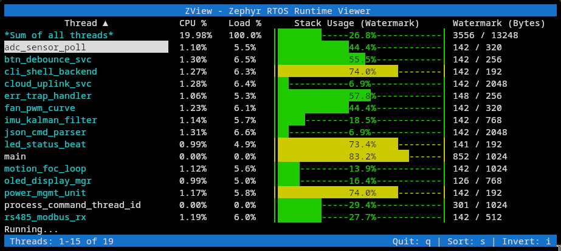
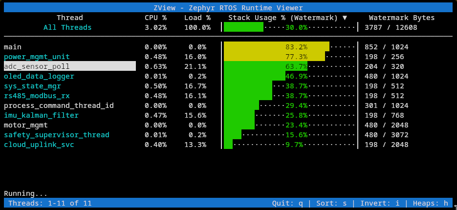
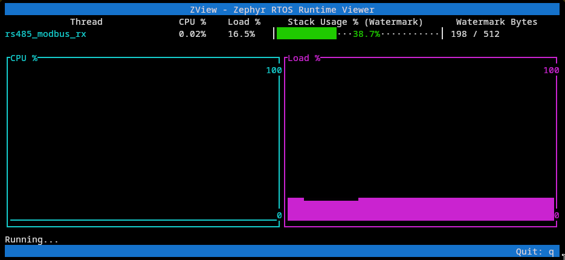
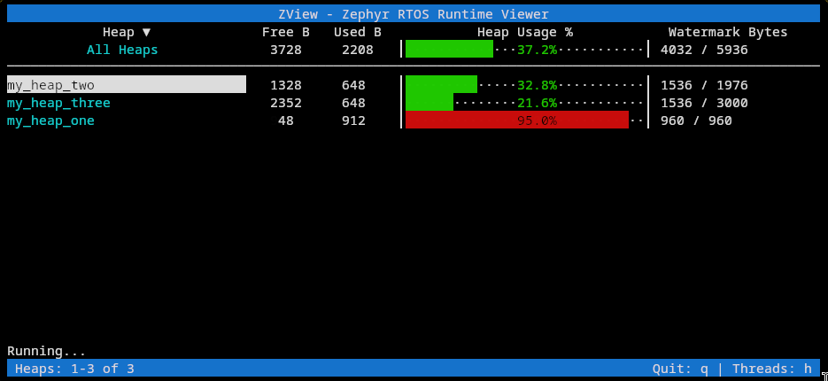
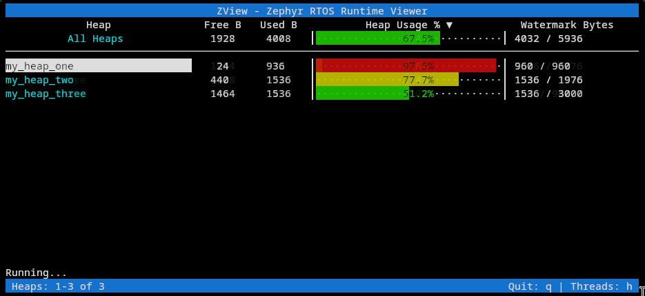

# ZView, a Zephyr RTOS runtime visualizer

Zephyr RTOS system-wide runtime visualizer via SWD probe!

Take a broader look on your Zephyr application with a non-heavy, small footprint, Kconfig-only thread stats analyser.

---

## Prerequisites

To properly analyze your Zephyr app, your ELF binary must be compiled with specific Kconfig options enabled:

```conf
## prj.conf
CONFIG_INIT_STACKS=y            # Required for stack watermarks
CONFIG_THREAD_MONITOR=y         # Required for thread discovery
CONFIG_THREAD_STACK_INFO=y      # Required for thread metadata

# Optional Features
CONFIG_THREAD_NAME=y            # Enables thread name display
CONFIG_THREAD_RUNTIME_STATS=y   # Enables CPU usage tracking
CONFIG_SYS_HEAP_RUNTIME_STATS=y # Enables heap runtime stats

```
---

## Manual Installation

Install ZView in your Python virtual environment:

```shell
# From the root of the zview repository
pip install -e .
```

Or directly through pip:

```shell
pip install zview
```

---

## How to Use

### Running from the CLI (manual mode)

```shell
zview -e build/zephyr/zephyr.elf -r runner -t runner_mcu_descriptor
```

### Integrated West Command

On your project west environment, with your board flashed and probed, run:

```shell
west update zview
west zview
```

This can be achieved by adding this snippet to your west manifest:

```yaml
manifest:
  projects:
    - name: zview
      path: tools/zview
      revision: main
      url: https://github.com/wkhadgar/zview
```


### CLI Arguments

| Argument | Description |
| --- | --- |
| `-e, --elf-file` | Path to the firmware `.elf` file. |
| `-r, --runner` | Manually select `jlink` or `pyocd`. |
| `-t, --runner-target` | MCU descriptor name, as used by the choosen runner. |
| `--period` | Update period in seconds, can be float. |

---

## How it works

ZView achieves a minimal footprint by avoiding on-target processing or UART/Shell output. It utilizes the debug probe's ability to read memory via the APB bus without halting the CPU. By parsing the ELF file, ZView identifies kernel object locations and performs analysis of stack watermarks and CPU usage.

> [!NOTE]
> The `idle` thread is implicit and only express itself on the used CPU %, when available.

---

## Navigation

ZView acts as a TUI. Navigate with **UP** and **DOWN** arrows from the default view:

* **ENTER**: Track CPU usage for a specific thread (hit ENTER again to return).
* **S / I**: Sort the data and Invert the sorting order.
* **H**: Access the **Heap Runtime** visualization.














---

## Roadmap

Based on community feedback, the following features are in development:

- Detailed thread metrics (e.g., context switch counts).
- Live global variables tracking

Also, Feel free to open an [issue](https://github.com/wkhadgar/zview/issues) if you feel like this has some potential!
