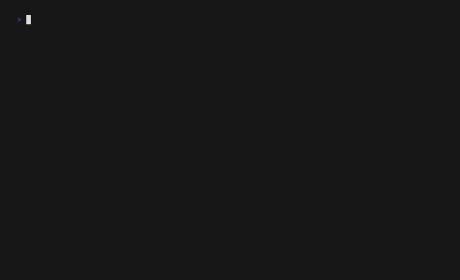
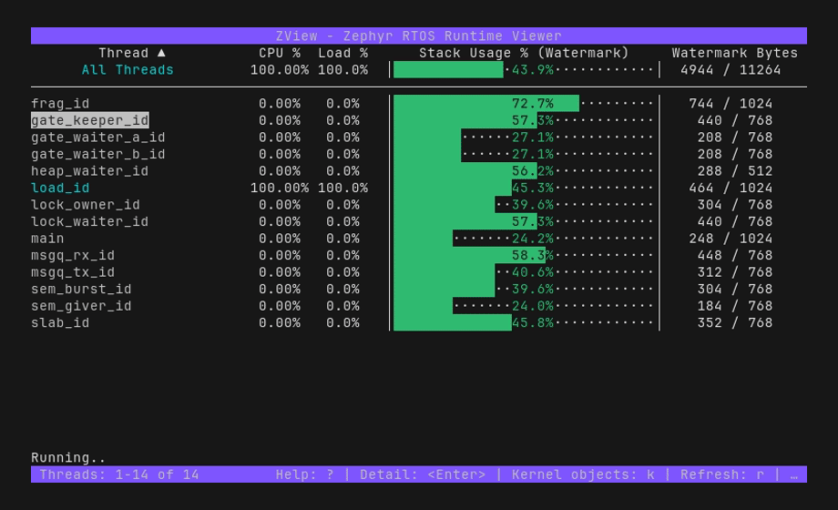
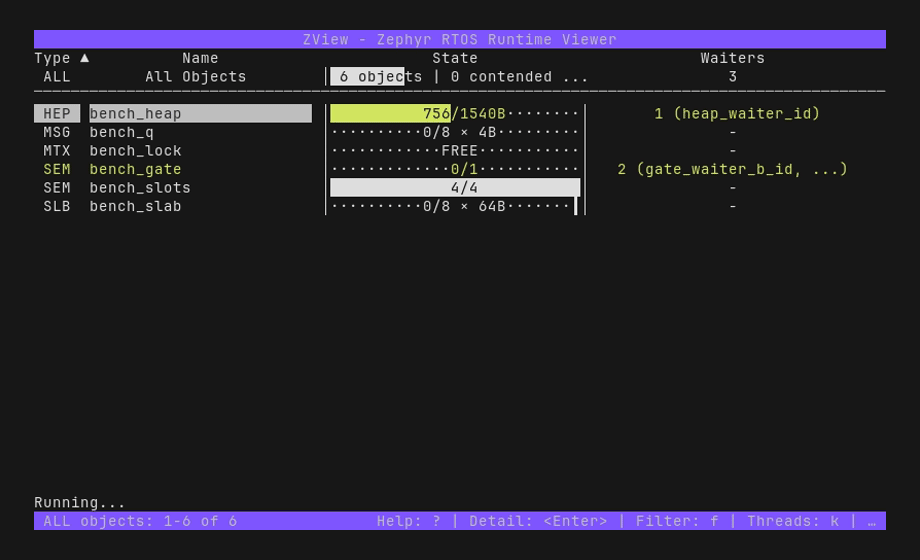
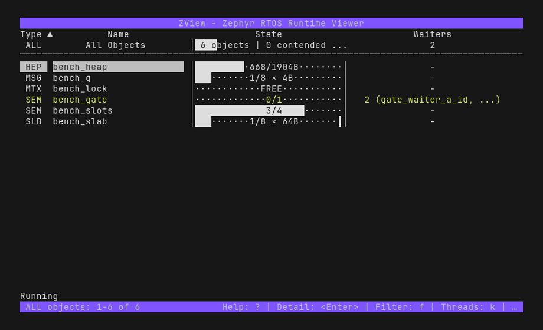
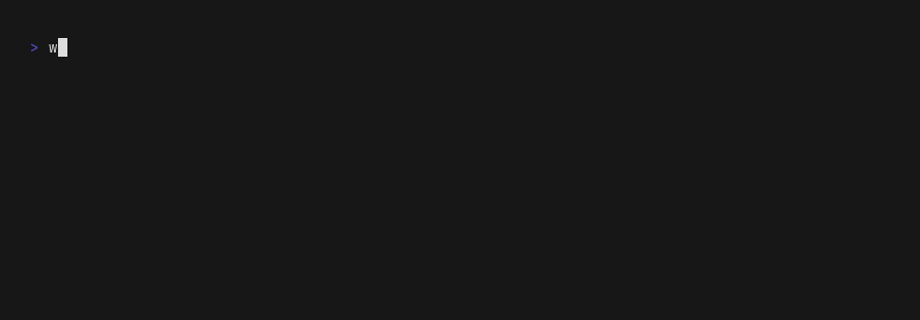
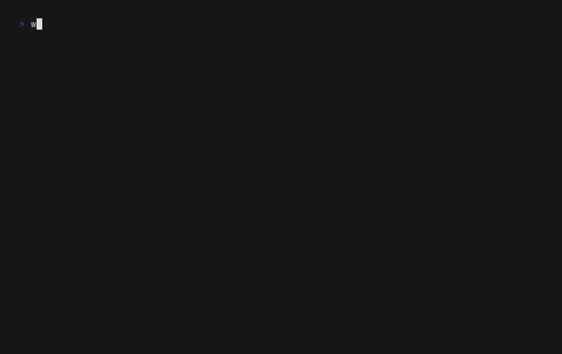

# ZView, a Zephyr RTOS runtime visualizer

Real-time system observability for Zephyr RTOS, delivered over SWD.

**Stop guessing your stack margins and heap health.** ZView provides a zero-footprint, high-fidelity visualization of your Zephyr application’s runtime, delivered over SWD with zero instrumentation.

*No UART, no RTT, and no manual code changes. Just Kconfig and your probe.*

> **Looking for the standalone pip installation?** See [README_pip.md](README_pip.md).

---

## Prerequisites

To properly analyze your Zephyr app, your ELF binary must be compiled with specific Kconfig options enabled:

```
## prj.conf
CONFIG_INIT_STACKS=y            # Required for stack watermarks
CONFIG_THREAD_MONITOR=y         # Required for thread discovery
CONFIG_THREAD_STACK_INFO=y      # Required for thread metadata

# Optional Features
CONFIG_THREAD_NAME=y                       # Enables thread name display
CONFIG_THREAD_RUNTIME_STATS=y              # Enables CPU usage tracking
CONFIG_SYS_HEAP_RUNTIME_STATS=y            # Enables heap runtime stats and fragmentation map
CONFIG_MEM_SLAB_TRACE_MAX_UTILIZATION=y    # Enables the memory slab peak
```

## Installation

Add this snippet to your west manifest:

```yaml
manifest:
  projects:
    - name: zview
      url: https://github.com/wkhadgar/zview
      revision: main
      path: modules/tools/zview
      west-commands: scripts/west-commands.yml
```

Then fetch it with:

```
west update zview
```

## How to Use

If your board is already flashed and probed, ZView can often infer the ELF path and runner from the build directory, so just run:

```
# From project root
west zview
```

Or pass arguments explicitly:

```
# Example: nRF5340 DK via JLink
west zview live -e build/zephyr/zephyr.elf -r jlink -t nRF5340_xxAA
```

## Commands

ZView is invoked through one of four commands. Bare `zview` with no command runs `live`.

| Command | Purpose | TUI |
| --- | --- | --- |
| `live` | Attach to a probe and render the TUI. Default when no command is given. | yes |
| `record` | Capture a live session to a `.ndjson.gz` recording file and exit. | no |
| `replay` | Render the TUI from a previously captured recording. | yes |
| `dump` | Emit a single polling frame and exit. | no |

### Common arguments

| Argument | Used by | Description |
| --- | --- | --- |
| `-e, --elf-file` | all | Path to the firmware `.elf` file (e.g. `build/zephyr/zephyr.elf`). |
| `-r, --runner` | `live`, `record`, `dump` | Debug runner: `jlink`, `pyocd`, or `gdb`. |
| `-t, --runner-target` | `live`, `record`, `dump` | MCU descriptor for the chosen runner (see below). |
| `--period` | `live`, `record`, `dump` | Polling period in seconds (default: `0.10`). |

### Command-specific arguments

| Argument | Command | Description |
| --- | --- | --- |
| `-o, --output` | `record` | Recording target path (`.ndjson.gz`). |
| `--duration` | `record` | Recording upper bound, in seconds. |
| `--frames` | `record` | Recording upper bound, in data frames. |
| `-i, --input` | `replay`, `dump` | Recording source path (`.ndjson.gz`). |
| `--no-pacing` | `replay` | Drain the recording as fast as possible instead of honoring its wall-clock cadence. |
| `--frame` | `dump` | Which polling frame to emit (1-indexed; default: `1`). |
| `--json` | `dump` | Emit the frame as JSON on stdout. |

<details>
<summary><strong>Finding the right value for <code>-t</code></strong></summary>
<br>

The `-t` argument is the MCU descriptor name **as expected by your chosen runner**. How to find it depends on the runner:

**JLink (`-r jlink`)**
Use the device name from the [J-Link Supported Devices list](https://www.segger.com/downloads/supported-devices.php).

```
# Example: Nordic nRF5340 DK
west zview live -e build/zephyr/zephyr.elf -r jlink -t nRF5340_xxAA
```

**pyOCD (`-r pyocd`)**
Run `pyocd list --targets` to see the available target names for your installed packs.

```
pyocd list --targets          # find your target name

# Example: STM32F401 Nucleo
west zview live -e build/zephyr/zephyr.elf -r pyocd -t stm32f401xe
```

**GDB server (`-r gdb`)**
Pass the `host:port` of your GDB server instead of a device name.

```
west zview live -e build/zephyr/zephyr.elf -r gdb -t localhost:1234
```

> **Tip:** The runner and target are often already defined in `build/zephyr/runners.yaml` (generated by `west build`). In that case you can omit `-r` and `-t` entirely and ZView will pick them up automatically.

</details>

## Navigation

ZView acts as a TUI. Navigate with **UP** and **DOWN** arrows from the default view:

* **?**: Open the contextual help overlay listing every binding active in the current view.
* **m**: Open the message log, holding the last reported messages with the time each arrived.
  The status row is reclaimed by the poll heartbeat, so this is where messages stay readable.
* **ENTER**: Get details for the selected thread or kernel object (hit ENTER again to return).
* **S / I**: Sort the data and invert the sorting order.
* **k**: Access the **Kernel Objects** view listing semaphores, mutexes, message queues, memory slabs and heaps (hit k again to return).
* **f**: In the kernel objects view, cycle the type filter (ALL, SEM, MTX, MSG, ALLOC, HEP, SLB).
* **r**: Soft refresh, re-walks the kernel thread list and clears runtime baselines.
* **R**: Full reconnect, tears down the polling thread, disconnects the probe, reconnects, and resumes.

### See your threads

Every running thread, at a glance. Sort by any column, invert the order, and pop the help overlay any time.



<details>
<summary><strong>See a thread's own view</strong></summary>
<br>

A thread carries its CPU and load graphs, building up live as it is polled.



</details>

### Watch your kernel objects

Press **k** for every statically declared `k_sem`, `k_mutex`, `k_msgq`, `k_mem_slab` and
`k_heap`: semaphore counts with their waiter lists, mutexes with the thread that holds
each lock, queues with their fill level, and slabs and heaps with what they have handed
out. **f** cycles the type filter, and the aggregate row on top sums whatever the filter
leaves.


**ENTER** opens the selected object on its own history.

<details>
<summary><strong>See each object's view</strong></summary>
<br>

A mutex carries its owner, lock depth, the threads queued behind it, and a per-frame lock strip that separates free from held alone from held with waiters.


A semaphore plots its count against the limit over time, so a sweep from empty to full and the burst that drains it read visually.


A queue plots its depth against its capacity, with the threads parked on it: senders when it is full, receivers when it is empty.



A slab plots the blocks it has out against the blocks it owns, with its peak marked on the bar if the build sets `CONFIG_MEM_SLAB_TRACE_MAX_UTILIZATION`.


A heap plots the bytes it has out against the bytes it accounts for, and opens onto a map of its allocated chunks in address order, with the threads waiting for memory beside it.



</details>

## Offline workflows

ZView can record a live session to disk, replay it later without a probe, or emit a single frame as JSON for CI.

**Record a live session:**



```
# 30 s of live polling from a JLink probe, saved to disk
west zview record -e build/zephyr/zephyr.elf -r jlink -t nRF5340_xxAA \
  -o capture.ndjson.gz --duration 30
```

Bound the recording by either `--duration` (seconds) or `--frames` (number of data frames).

**Replay it later, no hardware needed:**


```
# Feed the recording into the TUI
west zview replay -e build/zephyr/zephyr.elf -i capture.ndjson.gz
```

By default the replay honors the recording's original cadence. Pass `--no-pacing` to drain it as fast as possible.

The ELF is still required: DWARF offsets are resolved at replay time and are not stored in the recording.

**CI-friendly single-frame snapshot:**



```
# One polling frame from a live probe, dumped as JSON on stdout
west zview dump -e build/zephyr/zephyr.elf -r jlink -t nRF5340_xxAA --json \
  | jq '.threads[] | select(.runtime.stack_watermark_percent > 80)'
```

`dump` accepts either a live source (`-r`/`-t`) or a recording (`-i`). Omit `--json` for a human-readable one-shot dump. Use `--frame N` to emit the Nth polling frame instead of the first.

> **Note:** Status messages (probe connect, ELF load) are emitted on stderr, so stdout stays clean for piping into `jq` or similar.

---

## Advanced

<details>
<summary><strong>QEMU/GDB Targets</strong></summary>
<br>

If `debugserver` is available:

```
west debugserver
```

Or launch a GDB server from QEMU directly with `-s`, if you have no `runners.yaml` (e.g. `mps2/an385`):

```
qemu-system-arm \
  -machine mps2-an385 \
  -cpu cortex-m3 \
  -kernel build/zephyr/zephyr.elf \
  -nographic \
  -serial mon:stdio \
  -s
```

Then attach ZView:

```
west zview live -r gdb -t localhost:1234
```

> **Note:** Due to GDB server limitations, when using `-r gdb` the target is briefly halted prior to memory reads. Be aware of this side effect.

</details>

<details>
<summary><strong>Kernel object coverage</strong></summary>
<br>

Only statically declared objects are listed. `K_SEM_DEFINE`, `K_MUTEX_DEFINE`, `K_MSGQ_DEFINE`, `K_MEM_SLAB_DEFINE`, `K_HEAP_DEFINE` and friends land in the symbol table, where ZView finds them while parsing the ELF; an object created at runtime has no symbol and never appears in the view. Nor does one the linker drops: an object no code touches is garbage collected out of the symbol table, however statically it was declared.

> **Note:** Waiter lists need a `sys_dlist_t` wait queue, Zephyr's default (`CONFIG_WAITQ_SIMPLE`). Under `CONFIG_WAITQ_SCALABLE` the queue is a red-black tree, and the waiters column reads `unknown` instead of a count.

</details>

<details>
<summary><strong>How it works</strong></summary>
<br>

ZView achieves a minimal footprint by avoiding on-target processing or UART/Shell output. It utilizes the debug probe's ability to read memory via the APB bus without halting the CPU. By parsing the ELF file, ZView identifies kernel object locations, performs analysis of stack watermarks, thread CPU usages, and executes a deterministic walk of physical heap chunks to map memory fragmentation.

Every value is sampled at the polling period, so state that appears and disappears between two polls is never seen: a lock taken and released, a thread that starts and exits, an allocation made and freed. The high-water marks are the exception, since a stack watermark and a slab's peak usage hold their maximum between reads.

> **Note:** The `idle` thread is implicit and only expresses itself on the used CPU %, when available.

</details>

Feel free to open an [issue](https://github.com/wkhadgar/zview/issues) if you feel like this has some potential!
