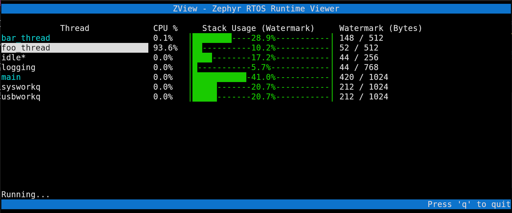

# ZView, a Zephyr RTOS htop

Zephyr RTOS system-wide runtime visualizer via SWD probe!

Take a broader look on your Zephyr application with a no code effortless thread stats TUI.

## How to use

To be able to properly analyze your Zephyr app, your ELF binary must be compiled and flashed with just some Kconfig
extra options:

```conf
## prj.conf

CONFIG_THREAD_NAME=y           # For thread names xP
CONFIG_INIT_STACKS=y           # For Stack Watermarks
CONFIG_THREAD_MONITOR=y        # For thread search
CONFIG_THREAD_RUNTIME_STATS=y  # For CPU usage tracking
```

You will also need a debug probe capable of SWD debugging, currently only Segger JLink probes are supported, but more
are to come!

Then just run ZView on your Zephyr env:

```shell
(.venv) $ python zview.py --mcu YOUR_MCU_TAG_NAME -e path/to/your/elf
```

> [!NOTE] 
> The MCU tag name is the name attributed to tour MCU for JLink connection.

****
## How it works

ZView attempts to be a neat tool for those who need to debug applications without the need of a shell/UART for stack
statistics. The intent is to achieve minimal footprint and behaviour branching for the binary, avoiding statistics
stdouts and processing threads. 

The keypoint is to take advantage of the debug probes ability to read runtime memory
without CPU halting from the APB bus, since ELF file contains all information needed about the kernel objects, we just
scan through the stack list and runtime analyse watermarks and CPU usages, so your source code can be kept free from
debug implementations.

****
## Navigation

ZView acts as a TUI, so you navigate with the arrow keys UP and DOWN from the default view:



To track CPU usage for a thread just hit ENTER over it:

