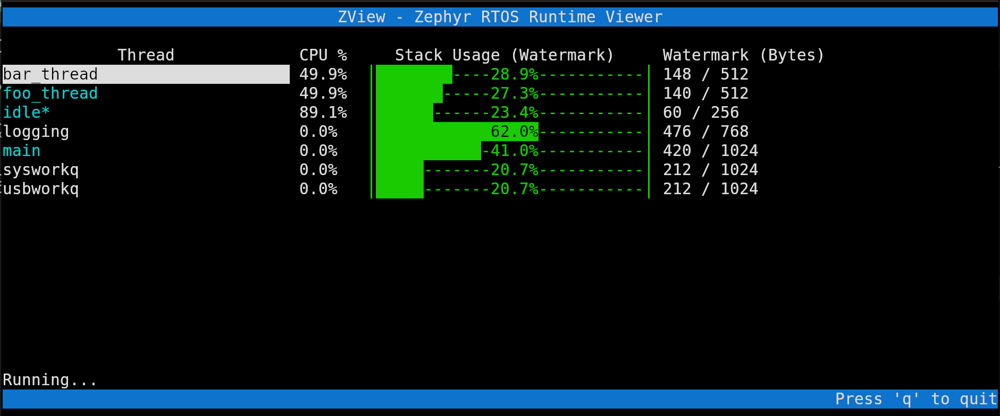
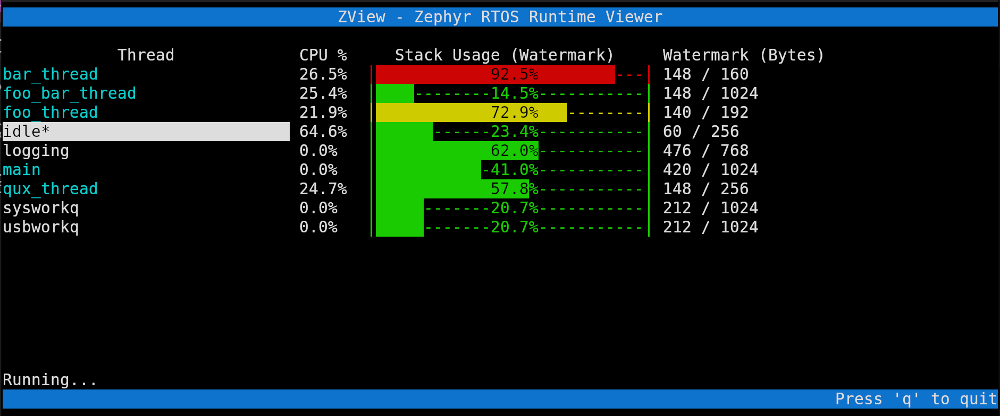

# ZView, a Zephyr RTOS runtime visualizer

Zephyr RTOS system-wide runtime visualizer via SWD probe!

Take a broader look on your Zephyr application with a non-heavy, small footprint, Kconfig-only thread stats analyser.

## Prerequisites

To properly analyze your Zephyr app, your ELF binary must be compiled with specific Kconfig options enabled:

```conf
## prj.conf
CONFIG_INIT_STACKS=y            # Required for stack watermarks
CONFIG_THREAD_MONITOR=y         # Required for thread discovery
CONFIG_THREAD_STACK_INFO=y      # Required for thread metadata

# Optional Features
CONFIG_THREAD_NAME=y            # Enables thread name display
CONFIG_THREAD_RUNTIME_STATS=y   # Enables CPU usage tracking
CONFIG_SYS_HEAP_RUNTIME_STATS=y # Enables heap runtime stats

```

## Installation

Install ZView in your Python virtual environment:

```shell
# From the root of the zview repository
pip install -e .
```

Or directly through pip:

```shell
pip install zview
```


## How to Use

ZView automatically detects your hardware target and MCU by parsing the `runners.yaml` generated by Zephyr.

### Running from the CLI (manual mode)

```shell
zview -e build/zephyr/zephyr.elf --runners_yaml build/zephyr/runners.yaml
```

### Integrated West Target

On a ZView compatible Zephyr version, run the target:

```shell
west build -t zview
```

This can also be achieved by adding this snippet to your Zephyr `CMakeLists.txt`:

```CMakeLists
find_program(ZVIEW zview)

if(NOT ${ZVIEW} STREQUAL ZVIEW-NOTFOUND)
  if(CONFIG_INIT_STACKS AND CONFIG_THREAD_MONITOR AND CONFIG_THREAD_STACK_INFO)
    add_custom_target(
      zview
      ${ZVIEW}
      --elf          ${ZEPHYR_BINARY_DIR}/${KERNEL_ELF_NAME}
      --runners_yaml ${ZEPHYR_BINARY_DIR}/runners.yaml
      $<$<BOOL:$ENV{ZVIEW_RUNNER}>:--runner=$ENV{ZVIEW_RUNNER}>
      $<$<BOOL:${CONFIG_SYS_HEAP_RUNTIME_STATS}>:--has_heap_stats>
      $<$<BOOL:${CONFIG_THREAD_RUNTIME_STATS}>:--has_thread_runtime_stats>
      $<$<BOOL:${CONFIG_THREAD_NAME}>:--has_thread_names>
      --thread_name_size ${CONFIG_THREAD_MAX_NAME_LEN}
      DEPENDS ${logical_target_for_zephyr_elf}
        $<TARGET_PROPERTY:zephyr_property_target,${report}_DEPENDENCIES>
      WORKING_DIRECTORY ${CMAKE_CURRENT_BINARY_DIR}
      USES_TERMINAL
      )
  else()
    message(WARNING "There are unmet dependencies for ZView, it will be unable to run.")
  endif()
endif()
```

> [!NOTE]
> If it is needed to force one of the available runners with the `--runner` argument, it is possible to set an environment variable to do so, e.g.: `export ZVIEW_RUNNER=jlink`


### CLI Arguments

| Argument | Description |
| --- | --- |
| `-e, --elf-file` | **(Required)** Path to the firmware `.elf` file. |
| `--runners_yaml` | Path to `runners.yaml` for automatic MCU/Runner detection. |
| `--runner` | Manually select `jlink` or `pyocd`. |
| `--period` | Update period in seconds. |
| `-n, -r, -m` | Enable thread names, runtime stats, or heap stats. |

---

## How it works

ZView achieves a minimal footprint by avoiding on-target processing or UART/Shell output. It utilizes the debug probe's ability to read memory via the APB bus without halting the CPU. By parsing the ELF file, ZView identifies kernel object locations and performs analysis of stack watermarks and CPU usage.

> [!NOTE]
> The `idle` thread expresses true CPU activity. All other threads show usage percentage relative to **non-idle** time. If thread `foo` shows 50% usage and `idle` is 40%, `foo` is effectively consuming 30% of total CPU cycles (50% of the active 60%).

---

## Navigation

ZView acts as a TUI. Navigate with **UP** and **DOWN** arrows from the default view:

* **ENTER**: Track CPU usage for a specific thread (hit ENTER again to return).
* **S / I**: Sort the data and Invert the sorting order.
* **H**: Access the **Heap Runtime** visualization.







---

### In the future...

Listening to community feedback, ZView is ongoing some new features development, such as, and not limited to:

- Heap visualization
- Extra thread information (like number of context switches and so)
- Live global variables tracking
- IDK, feel free to open an [issue](https://github.com/wkhadgar/zview/issues) if you feel like this has some potential!
